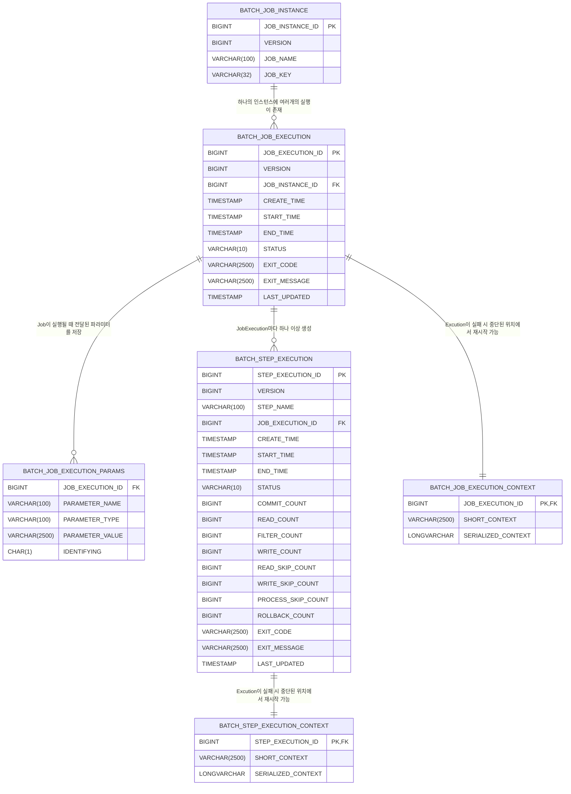

# 과제 01

## 스프링 배치의 특징
스프링 배치는 아래 6개의 테이블을 사용하여 배치 작업을 관리한다.
- BATCH_JOB_INSTANCE
- BATCH_JOB_EXECUTION
- BATCH_JOB_EXECUTION_CONTEXT
- BATCH_JOB_EXECUTION_PARAMS
- BATCH_STEP_EXECUTION
- BATCH_STEP_EXECUTION_CONTEXT

## 스프링 배치 스키마 구조

### 1. BATCH_JOB_INSTANCE
- Job의 생성(instance)에 관한 정보를 저장
- 주요 컬럼:
  - JOB_INSTANCE_ID: ID
  - JOB_NAME: Job의 이름
  - VERSION: 버전 (Update 시 증가)
  - JOB_KEY: 중복 수행 체크를 위해 존재하는 Job의 고유 키

### 2. BATCH_JOB_EXECUTION
- Job이 매번 실행(execution)될 때마다 새로운 데이터를 생성
- 주요 컬럼:
  - VERSION: 버전 (Update 시 증가)
  - JOB_INSTANCE_ID: BATCH_JOB_INSTANCE의 ID (FK)
  - CREATE_TIME: 생성 시간
  - START_TIME: 시작 시간
  - END_TIME: 종료 시간
  - STATUS: [상태](https://docs.spring.io/spring-batch/docs/5.1.2/api/org/springframework/batch/core/BatchStatus.html)
    - ABANDONED: 교착 상태
    - COMPLETED: Job을 성공적으로 종료된 상태
    - FAILED: Job 실행 중 실패한 상태
    - STARTED: Job이 실행 중인 상태
    - STARTING: Job이 실행을 시작한 상태
    - STOPPED: Job이 중지된 상태
    - STOPPING: Job이 중지 중인 상태
    - UNKNOWN: 알 수 없는 상태
  - EXIT_CODE: 종료 코드
  - EXIT_MESSAGE: 실패 시 종료 메시지

###  3. BATCH_JOB_EXECUTION_CONTEXT
- 작업 중 생성되는 ExcutionContext에 대한 모든 정보를 저장. Job Execution과 1:1 관계를 가짐. Excution이 실패 시 해당 정보를 사용하여 재시작 가능
- 주요 컬럼:
  - SHORT_CONTEXT: SERIALIZED_CONTEXT의 문자로 된 짧은 버전
  - SERIALIZED_CONTEXT: 직렬화된 전체 컨텍스트

### 4. BATCH_JOB_EXECUTION_PARAMS
- Job이 실행될 때 전달된 파라미터를 저장
- 주요 컬럼:
  - PARAMETER_NAME: 파라미터 이름
  - PARAMETER_TYPE: 파라미터 타입
  - PARAMETER_VALUE: 파라미터 값

### 5. BATCH_STEP_EXECUTION
- Job이 실행될 때마다 생성되는 Step Execution의 정보를 저장. BATCH_JOB_EXECUTION과 유사
- 주요 컬럼:
  - COMMIT_COUNT: Execution동안 트랜잭션 커밋된 카운트
  - READ_COUNT: Execution동안 읽은 아이템 카운트
  - FILTER_COUNT: Execution동안 필터링된 아이템 카운트
  - WRITE_COUNT: Execution동안 쓴 아이템 카운트
  - READ_SKIP_COUNT: Execution동안 읽기 스킵된 아이템 카운트
  - WRITE_SKIP_COUNT: Execution동안 쓰기 스킵된 아이템 카운트
  - PROCESS_SKIP_COUNT: Execution동안 프로세스 스킵된 아이템 카운트
  - ROLLBACK_COUNT: Execution동안 롤백된 아이템 카운트

### 6. BATCH_STEP_EXECUTION_CONTEXT
- 작업 중 생성되는 StepExecutionContext에 대한 모든 정보를 저장. Step Execution과 1:1 관계를 가짐. Excution이 실패 시 해당 정보를 사용하여 중단된 위치에서 재시작 가능

## ERD
H2 Database를 사용한다는 가정 하에 ERD를 작성하였다.

