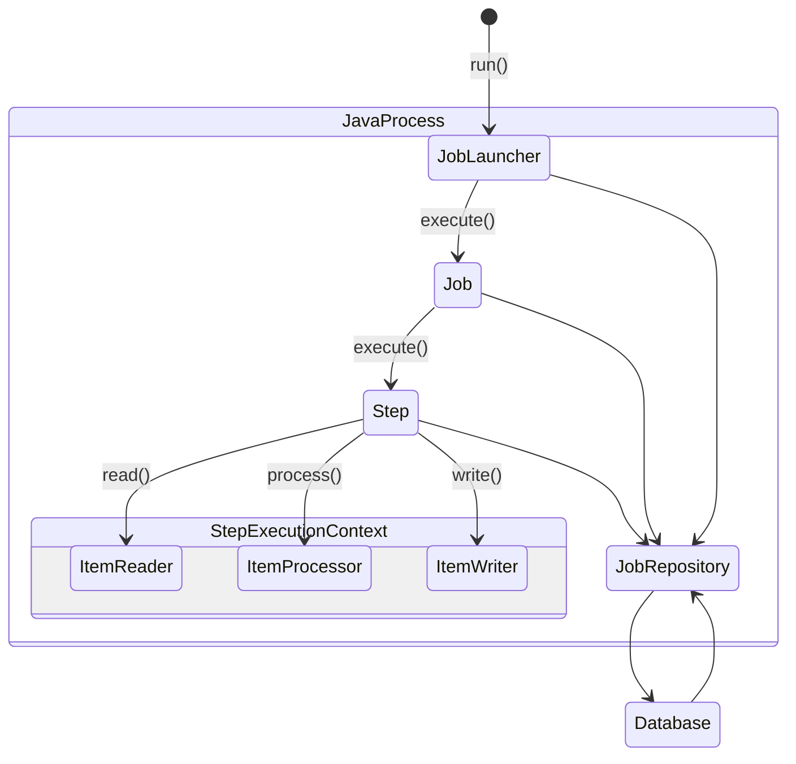

# 과제 02

## 스프링 배치 아키텍처

### 스프링 배치 모델
- Tasklet
  - 단순한 처리 모델
  - 유연한 사용 가능
- Chunk
  - 데이터량이 큰 작업에 적합
  - Reader, Processor, Writer로 구성


## 스프링 배치의 기본 아키텍처
 ```mermaid
classDiagram
  class JobRepository

  class JobLauncher
  class Job
  class Step

  class ItemReader
  class ItemProcessor
  class ItemWriter

  JobLauncher -- Job
  Job -- Step: 1 N
  JobLauncher <--> JobRepository
  Job <--> JobRepository
  Step <--> JobRepository
  
  Step -- ItemReader: 1
  Step -- ItemProcessor: 1
  Step -- ItemWriter: 1
```

### 스프링 배치 흐름

