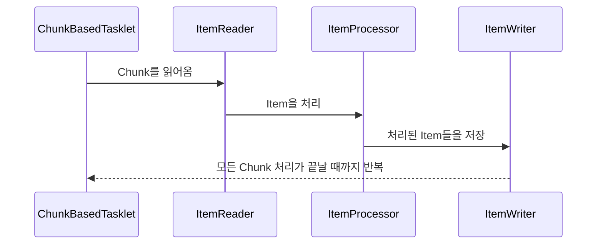

# 과제 3

## Chunk 모델
- 처리할 데이터를 Chunk 단위로 나누어 처리하는 모델
- ChunkBasedTasklet: Chunk 처리를 지원하는 클래스



## 스프링 배치 구현체
- ItemReader
  - `FlatFileItemReader`: (구조화되지 않은) 플랫 파일을 읽어오는 Reader
  - `StaxEventItemReader`: XML 파일을 읽어오는 Reader
  - `JdbcCursorItemReader`: JDBC 커서를 사용하여 데이터를 읽어오는 Reader
  - `JdbcPagingItemReader`: JDBC 페이징을 사용하여 데이터를 읽어오는 Reader
  - `JpaPagingItemReader`: JPA 페이징을 사용하여 데이터를 읽어오는 Reader
- ItemProcessor
  - `PassThroughItemProcessor`: 아무런 처리를 하지 않는 Processor
  - `ValidatingItemProcessor`: 유효성 검사를 수행하는 Processor. `org.springframework.batch.item.validator.Validator`를 구현해야함
  - `CompositeItemProcessor`: 동일한 입력 데이터에 대해 여러 `ItemProcessor`를 적용하는 Processor
- ItemWriter
  - `FlatFileItemWriter`: 플랫 파일에 데이터를 쓰는 Writer
  - `StaxEventItemWriter`: XML 파일에 데이터를 쓰는 Writer
  - `JdbcBatchItemWriter`: JDBC 배치를 사용하여 데이터를 쓰는 Writer
  - `JpaItemWriter`: JPA를 사용하여 데이터를 쓰는 Writer

## 실습

환경
- Java 17
- Spring Boot 3.3.4
- Spring Batch 5.1.2
- DB: PostgreSQL 17.0


## 실습 결과
Cursor 방식이 Paging 방식보다 빠르게 처리되는 것을 확인할 수 있음.

## Cursor 방식과 Paging 방식의 장단점
> 그러면 Cursor 방식이 더 좋은 거 아닌가?
-----------------
|    | Cursor 방식                                                  | Paging 방식                                  |
|----|------------------------------------------------------------|--------------------------------------------|
| 장점 | - Paging 방식에 비해 성능이 좋음 <br/> - 구현이 Paging 방식에 비해 간편함       | - 벙렬처리가 가능함 <br/> - Cursor 방식에 비해 안정적임     |
| 단점 | - 한번에 많은 양의 데이터를 가져오면 DB가 멈출 수 있음.<br/> - Thread Safe하지 않음 | - SortKey를 지정해야만함 <br/> - Cursor 방식에 비해 느림 |

## 실습 도중 겪은 이슈 정리

### `JobRegistryBeanPostProcessor`
Spring Batch 5.0 이상에서 `JobRegistry`의 Bean을 등록하는 `JobRegistryBeanPostProcessor`가 자동으로 등록되어 Bean 초기화와 관련된 [이슈](https://github.com/spring-projects/spring-batch/issues/4245)가 발생함.
```java
@Bean
public static BeanDefinitionRegistryPostProcessor jobRegistryBeanPostProcessorRemover() {
    return registry -> registry.removeBeanDefinition("jobRegistryBeanPostProcessor");
}
```
`JobRegistryBeanPostProcessor`를 자동으로 등록되지 않도록 설정함으로서 이슈를 해결할 수 있음

### `PagingQueryProvider`의 정렬조건(sortKey) 설정
PagingItemReader를 사용할 때 `PagingQueryProvider`의 `sortKey`를 설정하지 않으면 각각의 Chunk가 각기다른 정렬 조건을 가지고 처리를 수행할 수 있음

