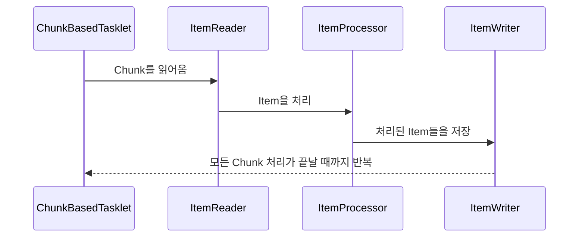

# 과제 3

## Chunk 모델
- 처리할 데이터를 Chunk 단위로 나누어 처리하는 모델
- ChunkBasedTasklet: Chunk 처리를 지원하는 클래스

## 스프링 배치 구현체
- ItemReader
  - `FlatFileItemReader`: (구조화되지 않은) 플랫 파일을 읽어오는 Reader
  - `StaxEventItemReader`: XML 파일을 읽어오는 Reader
  - `JdbcCursorItemReader`: JDBC 커서를 사용하여 데이터를 읽어오는 Reader
  - `JdbcPagingItemReader`: JDBC 페이징을 사용하여 데이터를 읽어오는 Reader
  - `JpaPagingItemReader`: JPA 페이징을 사용하여 데이터를 읽어오는 Reader
- ItemProcessor
  - `PassThroughItemProcessor`: 아무런 처리를 하지 않는 Processor
  - `ValidatingItemProcessor`: 유효성 검사를 수행하는 Processor. `org.springframework.batch.item.validator.Validator`를 구현해야함
  - `CompositeItemProcessor`: 동일한 입력 데이터에 대해 여러 `ItemProcessor`를 적용하는 Processor
- ItemWriter
  - `FlatFileItemWriter`: 플랫 파일에 데이터를 쓰는 Writer
  - `StaxEventItemWriter`: XML 파일에 데이터를 쓰는 Writer
  - `JdbcBatchItemWriter`: JDBC 배치를 사용하여 데이터를 쓰는 Writer
  - `JpaItemWriter`: JPA를 사용하여 데이터를 쓰는 Writer

