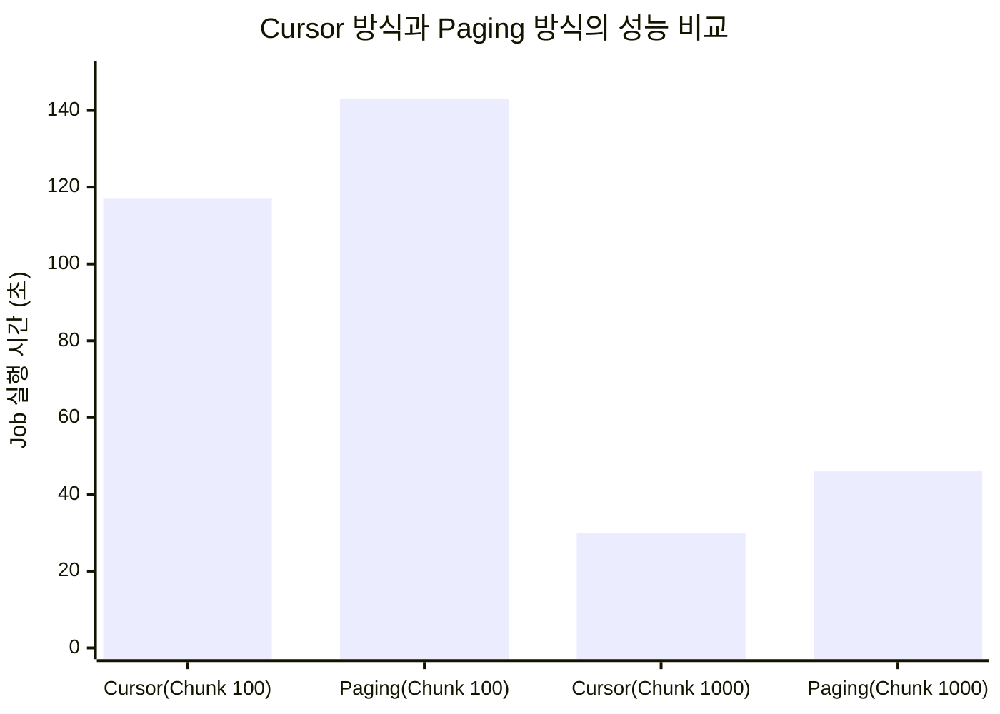

환경
- Java 17
- Spring Boot 3.3.4
- Spring Batch 5.1.2
- DB: PostgreSQL 17.0
- 데이터: 약 50만개

```mermaid
xychart-beta
  title "Cursor 방식과 Paging 방식의 성능 비교"
  x-axis ["Cursor(Chunk 100)", "Paging(Chunk 100)", "Cursor(Chunk 1000)", "Paging(Chunk 1000)"]
  bar [117, 143, 30, 46]
  y-axis "Job 실행 시간 (초)" 0 --> 150
```
